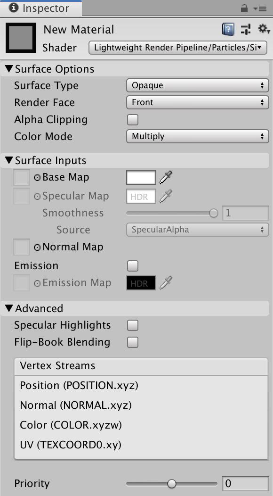
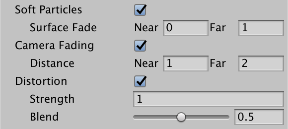

**Important:** This page is subject to change during the 2019.1 beta cycle.

# Particles Simple Lit Shader

Use this Shader for particles where performance is more important than photorealism. This Shader uses a simple approximation for lighting. Because this Shader [does not calculate for physical correctness and energy conservation](shading-model.md#simple-shading), it renders quickly. 

## Using the Particles Simple Lit Shader in the Editor

To select and use this Shader:

1. In your Project, create or find the Material you want to use the Shader on.  Select the __Material__. A Material Inspector window opens. 
2. Click __Shader__, and select __Lightweight Render Pipeline__ > __Particles__ > __Simple Lit__.

## UI overview

The Inspector window for this Shader contains these elements: 

- __[Surface Options](#surface-options)__
- __[Surface Inputs](#surface-inputs)__
- __[Advanced](#advanced)__

### Surface Options 

The __Surface Options__ control how LWRP renders the Material on a screen. 

| Property           | Description                                                  |
| ------------------ | ------------------------------------------------------------ |
| __Surface Type__   | Use this drop-down to apply an __Opaque__ or __Transparent__ surface type to the Material. This determines which render pass LWRP renders the material in. __Opaque__ surface types are always fully visible, regardless of what’s behind them. LWRP renders opaque Materials first. __Transparent__ surface types are affected by their background, and they can vary according to which type of transparent surface type you choose. LWRP renders transparent Materials in a separate pass after opaque objects.  If you select __Transparent__, the __Blending Mode__ drop-down appears. |
| __Blending Mode__  | Use this drop-down to determine how LWRP calculates the color of each pixel of the transparent Material by blending the Material with the background pixels. __Alpha__ uses the Material’s alpha value to change how transparent an object is. 0 is fully transparent. 1 appears fully opaque, but the Material is still rendered during the Transparent render pass. This is useful for visuals that you want to be fully visible but to also fade over time, like clouds. __Premultiply__ applies a similar effect to the Material as __Alpha__, but preserves reflections and highlights, even when your surface is transparent. This means that only the reflected light is visible. For example, imagine transparent glass. __Additive__ adds an extra layer to the Material, on top of another surface. This is good for holograms.  __Multiply__ multiplies the color of the Material with the color behind the surface. This creates a darker effect, like when you look through colored glass. |
| __Render Face__    | Use this drop-down to determine which sides of your geometry to render. __Front Face__ renders the front face of your geometry and [culls](https://docs.unity3d.com/Manual/SL-CullAndDepth.html) the back face. This is the default setting.  __Back Face__ renders the front face of your geometry and culls the front face.  __Both__ makes LWRP render both faces of the geometry. This is good for small, flat objects, like leaves, where you might want both sides visible. |
| __Alpha Clipping__ | Makes your Material act like a [Cutout](https://docs.unity3d.com/Manual/StandardShaderMaterialParameterRenderingMode.html) Shader. Use this to create a transparent effect with hard edges between the opaque and transparent areas. For example, to create blades of grass. To achieve this effect, LWRP does not render alpha values below the specified __Threshold__, which appears when you enable __Alpha Clipping__.  You can set the __Threshold__ by moving the slider, which accepts values from 0 to 1. All values above your threshold are fully opaque, and all values below your threshold are invisible. For example, a threshold of 0.1 means that LWRP doesn't render alpha values below 0.1. The default value is 0.5. |
| __Color Mode__     | Use this drop-down to determine how the particle color and the Material color blend together.  __Multiply__ produces a darker final color by multiplying the two colors. __Additive__ produces a brighter final colour by adding the two colours together. __Subtractive__ subtracts the particle color from the base color of the Material. This creates an overall dark effect in the pixel itself, with less brightness. __Overlay__ blends the particle color over the base color of the Material. This creates a brighter color at values over 0.5 and darker colors at values under 0.5. __Color__ uses the particle color to colorize the Material color, while keeping the value and saturation of the base color of the Material. This is good for adding splashes of color to monochrome Scenes. __Difference__ returns the difference between both color values. This is good for blending Particle and Material colors that are similar to each other. |

### Surface Inputs

The __Surface Inputs__ describe the surface itself. For example, you can use these properties to make your surface look wet, dry, rough, or smooth. 

| Property         | Description                                                  |
| ---------------- | ------------------------------------------------------------ |
| __Base Map__     | Adds color to the surface. To assign a Texture to the __Base Map__ setting, click the object picker next to it. This opens the Asset Browser, where you can select from the Textures in your Project. Alternatively, you can use the [color picker](https://docs.unity3d.com/Manual/EditingValueProperties.html). The color next to the setting shows the tint on top of your assigned Texture. To assign another tint, you can click this color swatch. If you select __Transparent__ or __Alpha Clipping__ under __Surface Options__, your Material uses the Texture’s alpha channel or color. The Base Map is also known as a diffuse map. |
| __Specular Map__ | Controls the color of your specular highlights from direct lighting, for example [Directional, Point, and Spot lights](https://docs.unity3d.com/Manual/Lighting.html). To assign a Texture to the __Specular Map__ setting, click the object picker next to it. This opens the Asset Browser, where you can select from the Textures in your Project. Alternatively, you can use the [color picker](https://docs.unity3d.com/Manual/EditingValueProperties.html).  In__ Source__, you can select a Texture in your Project to act as a source for the smoothness. By default, the source is the alpha channel for this Texture.  You can use the __Smoothness__ slider to control the spread of highlights on the surface. 0 gives a wide, rough highlight. 1 gives a small, sharp highlight like glass. Values in between 0 and 1 produce semi-glossy looks. For example, 0.5 produces a plastic-like glossiness. **Note:** If this setting appears greyed out, check if __Specular Highlights__ are enabled under the __Advanced__ settings. |
| __Normal Map__   | Adds a normal map to the surface. With a [normal map](https://docs.unity3d.com/Manual/StandardShaderMaterialParameterNormalMap.html), you can add surface details like bumps, scratches and grooves. To add the map, click the object picker next to it. The normal map picks up ambient lighting in the environment. |
| __Emission__     | Makes the surface look like it emits lights. When enabled, the  __Emission Map__ and __Emission Color__ settings appear. To assign an __Emission Map__, click the object picture next to it. This opens the Asset Browser, where you can select from the textures in your Project. For __Emission Color__, you can choose the color picker](https://docs.unity3d.com/Manual/EditingValueProperties.html) to assign a tint on top of the color. This can be more than 100% white, which is useful for effects like lava, that shines brighter than white while still being another color. If you have not assigned an __Emission Map__, the __Emission__ setting only uses the tint you’ve assigned in __Emission Color__. If you do not enable __Emission__, LWRP sets the emission to black and does not calculate emission. |

### Advanced

The __Advanced__ settings affect behind-the-scenes rendering. They do not have a visible effect on your surface, but on underlying calculations that impact performance.

| Property                | Description                                                  |
| ----------------------- | ------------------------------------------------------------ |
| __Flip-Book Blending__  | Tick this box to blend flip-book frames together. This is useful in texture sheet animations with limited frames, because it makes animations smoother. If you have performance issues, try turning this off. |
| __Specular Highlights__ | When enabled, your particles have specular highlights from direct lighting, for example [Directional, Point, and Spot lights](https://docs.unity3d.com/Manual/Lighting.html). This means that each particle reflects the shine from these light sources. When disabled, these highlight calculations are not part of the Shader, which can make the Shader render faster. By default, this feature is enabled. |
| __Vertex Streams__      | This list shows the vertex streams that this Material requires in order to work properly. If the vertex streams aren’t correctly assigned, the __Fix Now__ button appears. Click this button to apply the correct setup of vertex streams to the Particle System that this Material is assigned to. |
| __Priority__            | Use this slider to determine the chronological rendering order for a Material. LWRP renders Materials with higher values first. You can use this to reduce overdraw on devices by making the pipeline render Materials in front of other Materials first, so it doesn't have to render overlapping areas twice. This works similarly to the [render queue](https://docs.unity3d.com/ScriptReference/Material-renderQueue.html) in the built-in Unity render pipeline. |

#### Transparent surface type

If you’ve chosen a Transparent surface type under [Surface Options](#surface-options), these options appear:

| Property           | Description                                                  |
| ------------------ | ------------------------------------------------------------ |
| __Soft Particles__ | Tick this box to make particles fade out when they get close to intersecting with the surface of other geometry written into the [depth buffer](https://docs.unity3d.com/Manual/class-RenderTexture.html). When you enable this feature, the **Surface Fade** settings appear: __Near__ sets the distance from the other surface where the particle is completely transparent. This is where the particle appears to fade out completely. __Far__ sets the distance from the other surface where the particle is completely opaque. The particle appears solid here. Distances are measured in world units. Only usable for transparent surface types.  **Note:** This setting uses the `CameraDepthTexture` that is created by LWRP. To use this setting, enable __Depth Texture__ in the [LWRP Asset](lwrp-asset.md) or for the [Camera](camera-inspector.md) that is rendering the particles. |
| __Camera Fading__  | Tick this box to make particles fade out when they get close to the camera. When you enable this feature, the __Distance__ settings appear: __Near__ sets the distance from the camera where the particle is completely transparent. This is where the particle appears to fade out completely. __Far__ sets the distance from the camera where the particle is completely opaque. The particle appears solid here. Distances are measured in world units.   **Note:** This uses the `CameraDepthTexture` that is created by LWRP. To use this setting, enable __Depth Texture__ in the [LWRP Asset](lwrp-asset.md) or for the [Camera](camera-inspector.md) that is rendering the particles. |
| __Distortion__     | Creates a distortion effect by making particles perform refraction with the objects drawn before them. This is useful for creating a heat wave effect or for warping objects behind the particles.  When you enable this feature, these settings appear: __Strength__ controls how much the Particle distorts the background. Negative values have the opposite effect of positive values. So if something was offset to the right with a positive value, the equal negative value offsets it to the left. __Blend__ controls how visible the distortion is. At 0, there is no visible distortion. At 1, only the distortion effect is visible.  **Note:** This uses the `CameraOpaqueTexture` that is created by LWRP. To use this setting, enable __Opaque Texture__ in the [LWRP Asset](lwrp-asset.md) or for the [Camera](camera-inspector.md) that is rendering the particles. |

